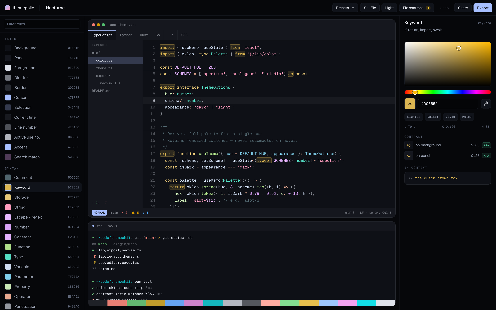
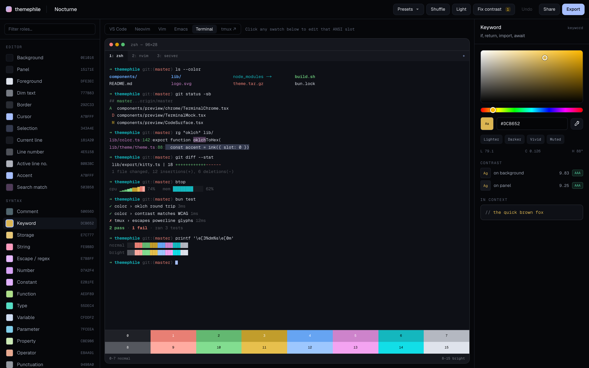
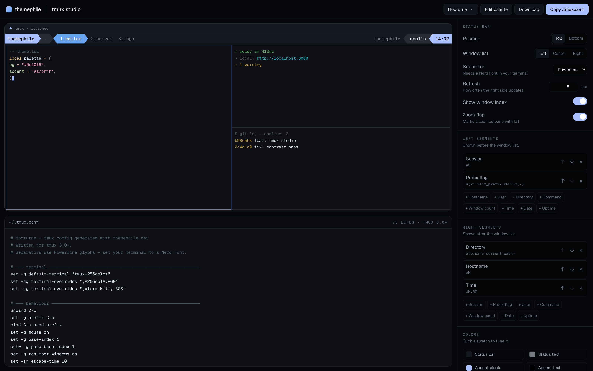

<div align="center">


# themephile

**A visual theme editor for code — and a tmux status bar builder.**
Tune every syntax color against real code, then copy a finished config
for your editor, your terminal, or tmux. No account. Nothing uploaded.

[](LICENSE)
[](https://nextjs.org)
[](#privacy)

</div>

---

## What it is

Most theme editors want an account before they'll let you pick a shade of blue.
This one doesn't have a backend to sign into. Everything — the palette
generator, the syntax highlighter, all ten exporters, and the importer that
reads someone else's theme file — runs in your browser.

There are two tools.

### Theme editor



Every token in the preview is a hit target. Click a keyword, edit the keyword
color. Select a role and it lights up everywhere it appears — in the code, in the
chrome, in the terminal.

**Five previews, one theme.** A colorscheme doesn't look the same in every
program, so the preview switches between them and draws each as itself:

| Preview | What it shows |
| --- | --- |
| **VS Code** | Activity bar, explorer with git letters, tabs, breadcrumbs, a live minimap, status bar |
| **Neovim** | Relative line numbers, sign column with git and diagnostic signs, inline virtual text, a floating `Pmenu`, powerline statusline |
| **Vim** | `~` filler past the buffer (visible, unlike Neovim's hidden `EndOfBuffer`), line-wise visual selection, plain statusline, `-- INSERT --` |
| **Emacs** | Fringes, region highlight, the boxed modeline in its real `-UUU:----F1` format, and the echo area |
| **Terminal** | Tab bar, `ls --color`, git status, a search match, a selection, test output, and normal-against-bright rows — plus a clickable ANSI 16 grid |

- **48 editable roles** — editor surface, 16 syntax roles, diagnostics, and the ANSI 16
- **Six languages** live-previewed: TypeScript/JSX, Python, Rust, Go, Lua, CSS
- **Shuffle** builds a whole coherent theme from a seed — hue, harmony scheme, chroma
- **Fix contrast** counts the roles failing WCAG AA-large and lifts them without touching hue
- Undo, eyedropper, live contrast ratios, and a share link that carries the entire palette

Opening **Export** lands on whichever program you're previewing.



### Import a theme you already have

**Import** takes the file two ways, because the formats split two ways. A VS
Code theme is something you copy out of a gist; an `.itermcolors` is something
you have on disk and have never once opened in an editor. So: paste it into the
box, or drop the file anywhere on the dialog. Both run the same reader, in your
browser.

| Read | From |
| --- | --- |
| **VS Code** | Workbench colors, TextMate scopes, semantic tokens. Handles JSONC — comments and trailing commas — because real themes are full of both. |
| **Neovim** | `nvim_set_hl` calls, `hl()` wrappers, or plain group tables, with `c.blue`-style palette references resolved. |
| **Vim** | `hi Group guifg=…` lines, plus `g:terminal_ansi_colors`. |
| **Emacs** | A `deftheme` — `let` bindings resolved through `custom-theme-set-faces`. |
| **base16 / base24** | Both the classic flat form and tinted-theming's `palette:` nesting. |
| **Terminals** | Alacritty (TOML *and* the older YAML), kitty, Ghostty, WezTerm, Windows Terminal, iTerm2 `.itermcolors`, Xresources. |
| **Anything else** | Any text with hex codes in it, sorted by lightness and hue into the nearest roles. |

Most formats are partial by nature — a kitty conf has sixteen ANSI colors and
nothing to say about comments. Rather than leave the gaps black, the missing
roles are derived from the ones that were found, following the [base16 styling
guideline](https://github.com/chriskempson/base16/blob/main/styling.md) for
which terminal color stands in for which syntax idea. The dialog then reports
the split — *"24 of 48 roles read from the file, 24 derived"* — and marks the
derived swatches with a dashed outline, so nothing is presented as having come
from your file when it didn't.

### tmux studio



Build your status bar by looking at it: reorder segments, switch separators,
set pane borders and the prefix key, and watch a live terminal redraw. Out comes
a complete `.tmux.conf`.

Browsers have no Nerd Font, so the preview draws powerline separators as CSS
shapes — identical silhouette, no tofu — while the exported config uses the real
`U+E0B0` glyphs.

## Exports

| Target | What you get |
| --- | --- |
| **VS Code** | Workbench chrome, TextMate scopes, semantic tokens, plus a `package.json` so it installs as a local extension. Works in Cursor and Windsurf. |
| **Neovim** | Lua colorscheme with treesitter captures, LSP semantic tokens, diagnostics, and groups for gitsigns / telescope / nvim-tree / cmp. |
| **Vim** | Classic vimscript with 256-color `cterm` fallbacks, so it survives SSH. |
| **Emacs** | `deftheme` covering font-lock (including the Emacs 29+ tree-sitter faces), org, diffs, and completion popups. |
| **Terminals** | Alacritty, kitty, Ghostty, WezTerm, Windows Terminal. |
| **tmux** | A full `.tmux.conf` — status bar, panes, messages, key bindings. |
| **JSON** | Every role as flat, stable keys, for writing your own exporter. |

Each one ships with install steps: where the file goes and what to type.

## Quick start

```bash
bun install
bun dev          # http://localhost:3000
```

```bash
bun run build    # production build
bun run start
bun run lint
```

Next.js 16 (App Router), React 19, Tailwind CSS v4. No runtime dependencies
beyond those — the syntax highlighter, the color math, and every exporter are
local code.

## Privacy

There is no server to send anything to. Your theme is saved to `localStorage`
and encoded into the URL fragment, so sharing a link shares the whole palette
without a database. No accounts, no analytics, no telemetry.

## How it works

**One vocabulary, many targets.** Every editor names things differently — VS
Code has TextMate scopes, Neovim has treesitter captures, Emacs has font-lock
faces. themephile defines 48 neutral *roles* in the middle, and each exporter
translates from those. Pick a color once; it lands everywhere.

**Palettes are generated, not hand-picked.** A theme comes from a small seed —
a background, a foreground, a base hue, a harmony scheme, and a chroma
multiplier — expanded in OKLCh. Because the math is perceptual, "10% lighter"
means the same thing on yellow as it does on blue, and Shuffle produces coherent
themes instead of confetti. Every derived color stays editable.

**The highlighter is custom on purpose.** Off-the-shelf highlighters emit
TextMate scopes, and collapsing ~2000 scopes onto 16 editable roles is guesswork
in the wrong direction. Here each token is *born* as a role, which is what makes
clicking a token in the preview and clicking its swatch the same action. It's
approximate — there's no parser — but it only has to be convincing enough to
judge a color by.

## Layout

```
app/
  page.tsx            landing
  editor/page.tsx     theme editor    → components/editor/EditorApp
  tmux/page.tsx       tmux studio     → components/tmux/TmuxApp
  icon.svg            the animated favicon
  apple-icon.tsx      iOS home-screen icon (iOS won't take an SVG)
  opengraph-image.tsx social card, one per route, generated from the real palette
  sitemap.ts          three static routes
  robots.ts           allow-all + sitemap pointer
  llms.txt/route.ts   derived from TARGETS/ROLE_IDS, so it can't describe a
                      product that no longer exists
lib/
  site.ts             canonical origin + shared OpenGraph fields
  seo/                JSON-LD graph, social-card renderer
  color.ts            OKLab/OKLCh conversion, WCAG contrast, xterm-256 matching
  theme/
    roles.ts          the 48 role ids — the vocabulary every exporter maps from
    theme.ts          seed → theme generator, contrast repair
    presets.ts        starting seeds
    serialize.ts      URL-fragment encoding, localStorage, downloads
  highlight/
    tokenize.ts       hand-rolled tokenizer (tsx, python, rust, go, lua, css)
    samples.ts        preview code
  export/             one module per target + the shared Vim/Neovim group table
  import/             format sniffing, one parser per format, and the
                      derivation that grows a partial read into all 48 roles
  tmux/               config model and .tmux.conf generator
components/
  preview/
    CodeSurface.tsx   the syntax-highlighted buffer, with per-editor gutters
    PreviewStage.tsx  the target switcher
    chrome/           one component per program: VS Code, Neovim, Vim, Emacs, Terminal
  editor/             role list, inspector, color picker, export dialog
  tmux/               status bar, terminal preview, controls
```

Adding a sixth preview means writing one `chrome/` component against the shared
`ChromeProps` and adding a row to `PREVIEW_TARGETS`. `CodeSurface` already
handles relative line numbers, sign columns, virtual text, selections, search
matches, and buffer filler, so most of the work is layout.

Both workspaces read browser state during their first render, so they mount with
`ssr: false` behind a prerendered skeleton — the static shell ships instantly and
there's no flash of the default theme before your saved one appears.

## Adding an export target

Implement `ExportTarget` (`lib/export/types.ts`) — an id, a label, a `files()`
returning one or more `{ filename, language, contents }`, and `install()` steps —
then add it to `TARGETS` in `lib/export/index.ts`. The export dialog, the landing
page list, and the download buttons pick it up automatically.

Vim and Neovim share one highlight-group table (`lib/export/groups.ts`) so the
two colorschemes can't drift apart.

## Verification

The generated configs are checked against the real programs, not just eyeballed:
the Emacs theme loads under `emacs --batch`, the Vim colorscheme sources under
`vim -es -u NONE`, and every `.tmux.conf` variant boots a real `tmux` server with
no errors.

## Contributing

Issues and pull requests are welcome. New export targets, new import formats,
new preset seeds, and tokenizer fixes for languages that look wrong are all good
places to start.

An importer is a `Parser` (`lib/import/types.ts`): an id, a label, a cheap
`detect()` sniff, and a `parse()` that returns whatever roles it can find.
Detection is deliberately optimistic — a format only wins if its parser actually
returns something — so add it to `PARSERS` above the vaguer formats and below
the more specific ones.

## License

[MIT](LICENSE) © justin06lee
